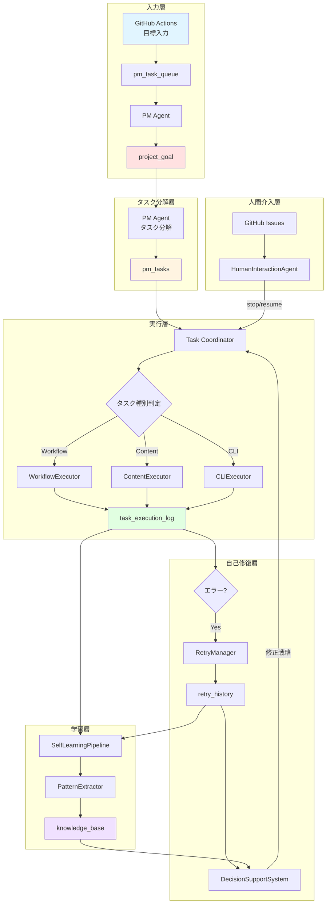
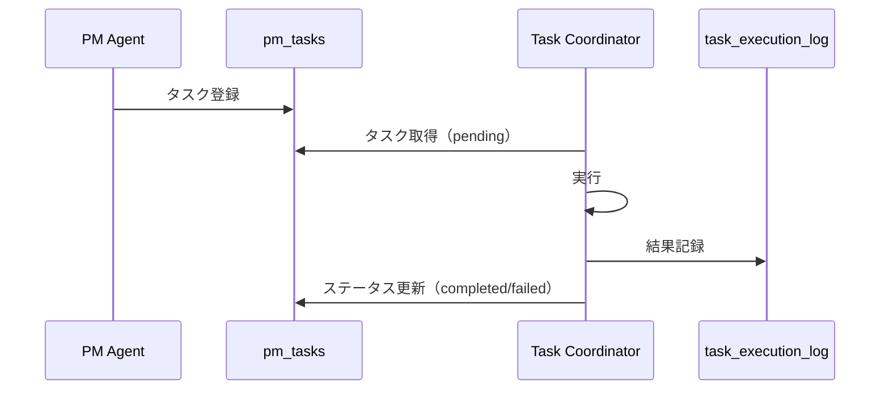
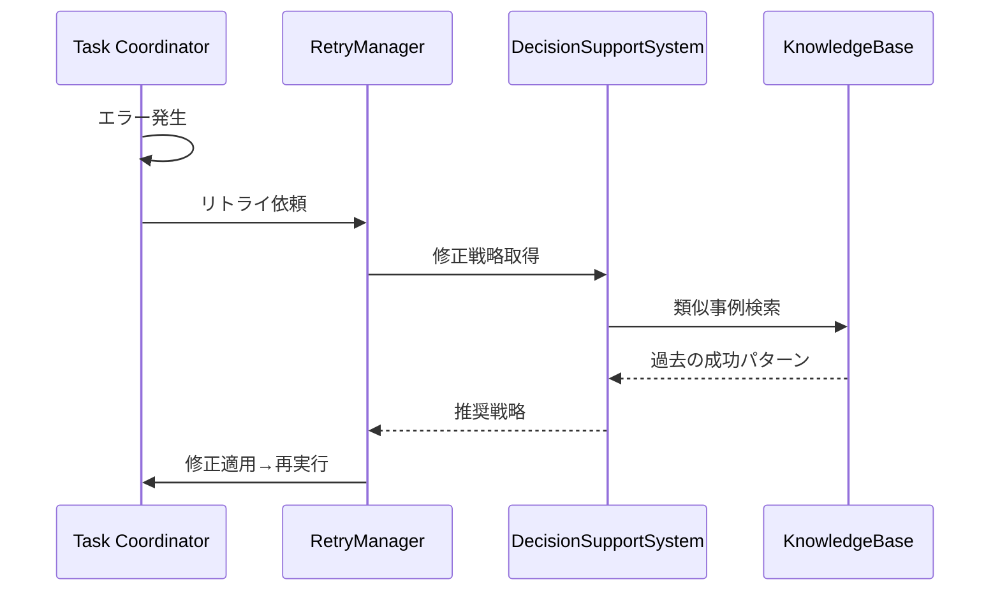
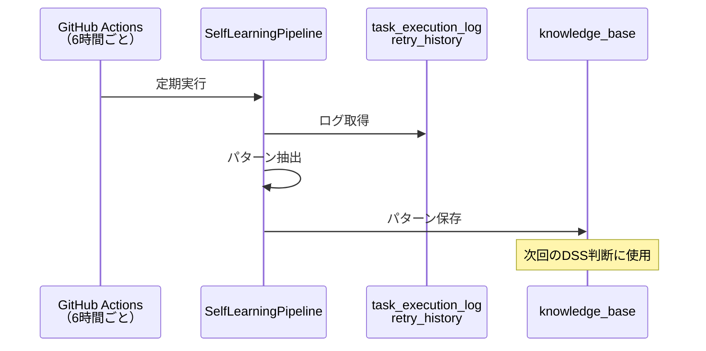
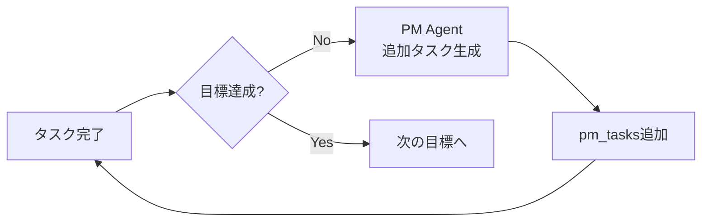
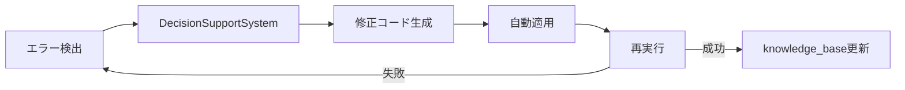

# 🔄 既存フィードバックループの全体像

## 📊 現在のシステム構成

## 🔍 各ループの詳細

### **Loop 1: タスク実行ループ（既存）**

**問題点:**
- ❌ タスク完了後の**次のタスク生成**がない
- ❌ タスク間の依存関係が不明確

---

### **Loop 2: 自己修復ループ（部分実装）**

**問題点:**
- ⚠️ DecisionSupportSystemが**実際に使われていない**
- ❌ KnowledgeBaseの検索結果が**実行に反映されない**

---

### **Loop 3: 学習ループ（自動実行なし）**

**問題点:**
- ❌ 学習結果が**即座に反映されない**
- ❌ 学習→適用のループが**6時間遅延**

---

## ❌ **不足しているループ**

### **Loop 4: 目標→タスク追加ループ（未実装）**

**現状:** タスクが完了しても、**次に何をすべきか自動判断しない**

---

### **Loop 5: エラー→修正コード生成ループ（未実装）**

**現状:** エラーを検出しても、**修正コードを生成・適用しない**

---

## 📋 改善が必要な箇所

| 箇所 | 現状 | 理想 | 優先度 |
|------|------|------|--------|
| タスク完了後 | 何もしない | 次のタスク自動生成 | �� 高 |
| エラー時 | ログのみ | 修正コード自動適用 | 🔴 高 |
| 学習 | 6時間遅延 | リアルタイム反映 | 🟡 中 |
| 目標達成判定 | 手動 | 自動判定→次の目標 | 🟢 低 |
| エージェント追加 | 手動 | 必要性を自動判断 | 🟢 低 |
