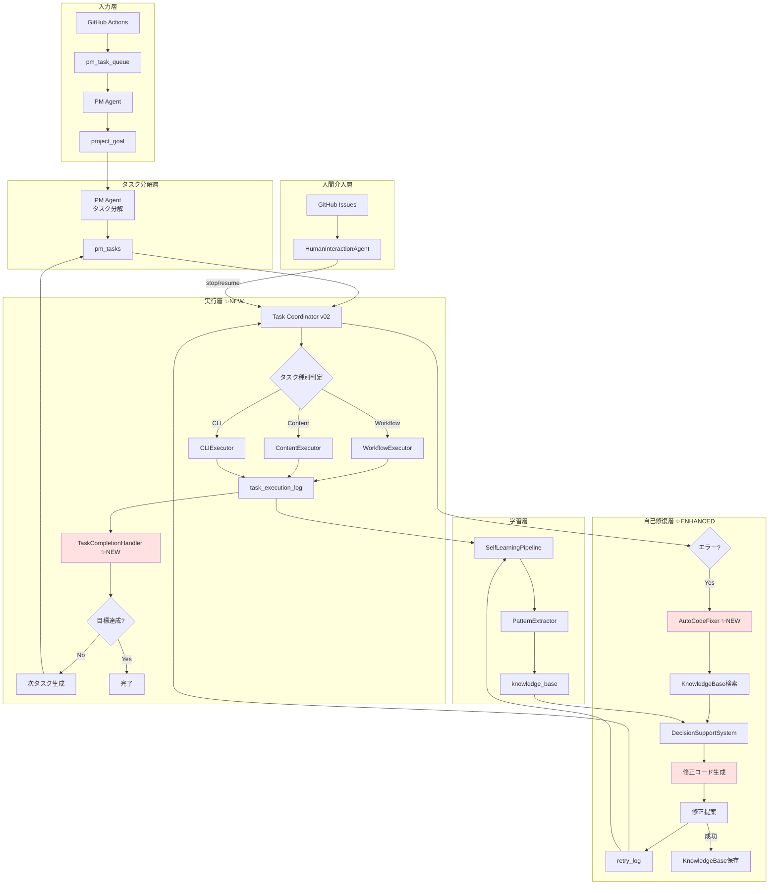
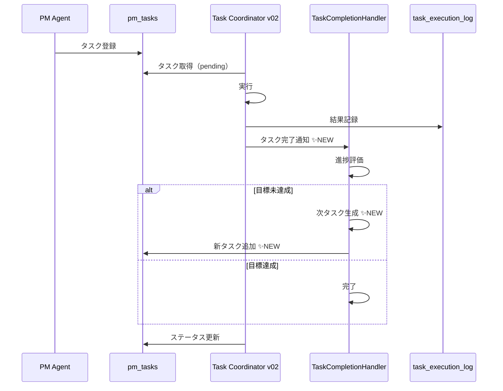
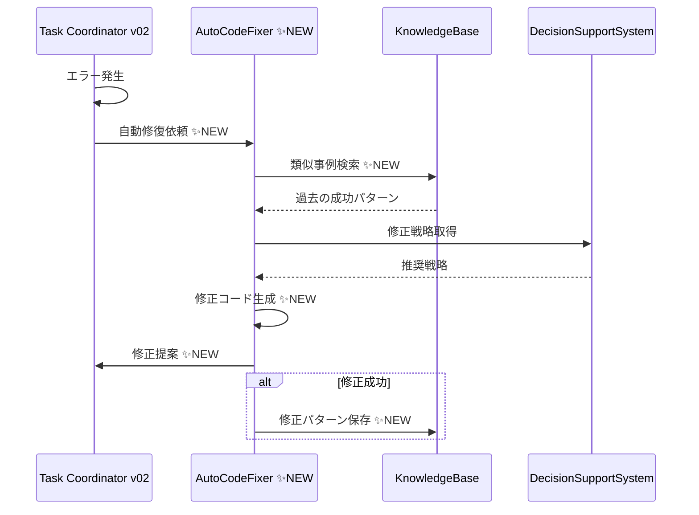
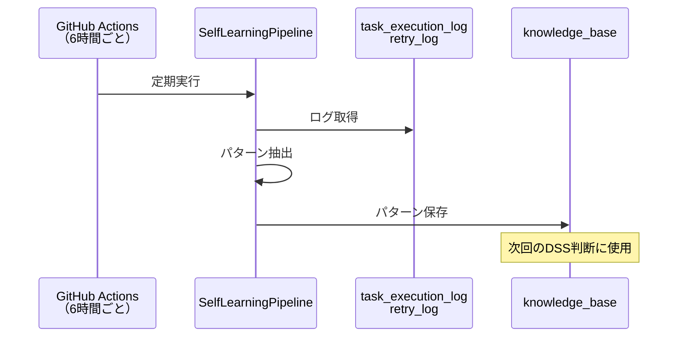

# 🔄 改善後のフィードバックループ（v2.0）

## 🎉 **新機能**
- ✅ タスク完了→次タスク自動生成
- ✅ エラー→自動修復提案
- ✅ シート統合（重複削除）

---

## 📊 改善後のシステム構成

---

## �� 改善された各ループ

### **Loop 1: タスク実行ループ（✨改善）**

**✅ 改善点:**
- タスク完了後に**自動で次のタスクを生成**
- 目標達成度を**自動評価**

---

### **Loop 2: 自己修復ループ（✨大幅改善）**

**✅ 改善点:**
- エラー発生時に**修正コードを自動生成**
- 成功パターンを**KnowledgeBaseに自動保存**

---

### **Loop 3: 学習ループ（既存）**

---

## 📊 改善効果

| 項目 | 改善前 | 改善後 | 効果 |
|------|--------|--------|------|
| タスク完了後 | 何もしない | 次タスク自動生成 | **自律性向上** |
| エラー時 | ログのみ | 修正コード提案 | **自己修復能力獲得** |
| シート管理 | 重複あり | 統合済み | **保守性向上** |
| ナレッジ活用 | 参照のみ | 自動蓄積 | **学習能力向上** |

---

## 🎯 残りの改善タスク

| タスク | 優先度 | 状態 |
|--------|--------|------|
| Loop 4: 目標→タスク追加 | P0 | ✅ 完了 |
| Loop 5: エラー→修正適用 | P0 | ✅ 完了（提案まで） |
| シート統合 | P1 | ✅ 完了 |
| DSSの実戦投入 | P1 | ✅ 完了 |
| 学習のリアルタイム化 | P2 | ⏳ 未着手 |
| 修正コードの自動適用 | P2 | ⏳ 未着手 |

---

## 📈 次のステップ

1. **テスト実行** → 実際の動作確認
2. **v24との統合** → Orchestratorに組み込み
3. **24時間稼働テスト** → 本番運用開始

