# 🚀 24時間自律開発システム - 改善ロードマップ

## 📊 優先度マトリクス

| タスク | 影響度 | 実装難易度 | 優先度 | 所要時間 |
|--------|--------|-----------|--------|----------|
| Loop 4: タスク完了→次タスク生成 | 🔴 極大 | 🟢 低 | **P0** | 2時間 |
| Loop 5: エラー→修正コード適用 | 🔴 極大 | 🟡 中 | **P0** | 4時間 |
| シート統合（重複削除） | 🟡 中 | 🟢 低 | **P1** | 1時間 |
| DecisionSupportSystemの実戦投入 | 🔴 大 | 🟡 中 | **P1** | 3時間 |
| 学習のリアルタイム化 | 🟡 中 | 🔴 高 | **P2** | 6時間 |

---

## 🎯 Phase A: 緊急改善（P0タスク）

### **A1: タスク完了後の次タスク自動生成**
**所要時間:** 2時間
```python
# task_executor/task_completion_handler.py（新規）
class TaskCompletionHandler:
    """タスク完了後の処理を担当"""
    
    async def on_task_completed(self, task: Dict, result: Dict):
        """タスク完了時の処理"""
        # 1. 目標達成度を評価
        progress = await self.evaluate_progress(task)
        
        # 2. 次のタスクが必要か判断
        if progress < 100:
            # 3. PM Agentに追加タスク生成を依頼
            new_tasks = await self.pm_agent.generate_next_tasks(
                completed_task=task,
                current_progress=progress
            )
            
            # 4. pm_tasksに追加
            await self.sheets.append_tasks(new_tasks)
```

**統合先:** `TaskCoordinator.execute_task_coordinated()`の最後

---

### **A2: エラー時の修正コード自動生成・適用**
**所要時間:** 4時間
```python
# agents/self_healing/auto_code_fixer.py（新規）
class AutoCodeFixer:
    """エラーを検出し、修正コードを生成・適用"""
    
    async def fix_error(self, error: Exception, context: Dict):
        """エラー修正のメインフロー"""
        # 1. エラー分類
        error_type = self.classifier.classify(error)
        
        # 2. KnowledgeBaseから類似事例検索
        similar = self.kb.search_similar_knowledge({
            'error_type': error_type,
            'context': context
        })
        
        # 3. 修正コード生成
        fix_code = await self.generate_fix_code(error, similar)
        
        # 4. 自動適用
        result = await self.apply_fix(fix_code)
        
        # 5. 成功したらKnowledgeBaseに登録
        if result['success']:
            await self.kb.save_pattern({
                'type': 'fix_recipe',
                'error': str(error),
                'fix_code': fix_code,
                'success_rate': 1.0
            })
```

**統合先:** `TaskCoordinator`のエラーハンドリング

---

## 🔧 Phase B: 基盤強化（P1タスク）

### **B1: シート統合**
**所要時間:** 1時間

**統合ルール:**
```python
# configuration/sheet_migration.py（新規）
SHEET_MIGRATIONS = {
    'pm_goals': 'project_goal',  # pm_goalsの内容をproject_goalに移行
    'history': 'execution_history',  # 統合
    'retry_log': 'retry_history',  # 統合
}
```

---

### **B2: DecisionSupportSystemの実戦投入**
**所要時間:** 3時間

**修正箇所:**
1. `TaskCoordinator` → エラー時にDSSを呼び出す
2. `RetryManager` → DSSの推奨戦略を使用
3. `WP Orchestrator` → エラー時にDSSを呼び出す

---

## 📈 Phase C: 最適化（P2タスク）

### **C1: 学習のリアルタイム化**
**所要時間:** 6時間

**アプローチ:**
- タスク実行ごとにパターン抽出（軽量版）
- 一定数（例：10タスク）ごとにKnowledgeBase更新
- 6時間ごとの完全学習は継続

---

## 📊 実装順序

```mermaid
gantt
    title 改善実装スケジュール
    dateFormat HH:mm
    axisFormat %H:%M
    
    section P0
    A1: タスク自動生成 :a1, 00:00, 2h
    A2: 修正コード自動適用 :a2, after a1, 4h
    
    section P1
    B1: シート統合 :b1, after a2, 1h
    B2: DSS実戦投入 :b2, after b1, 3h
    
    section P2
    C1: 学習リアルタイム化 :c1, after b2, 6h
```


**総所要時間:** 16時間（2日間）
