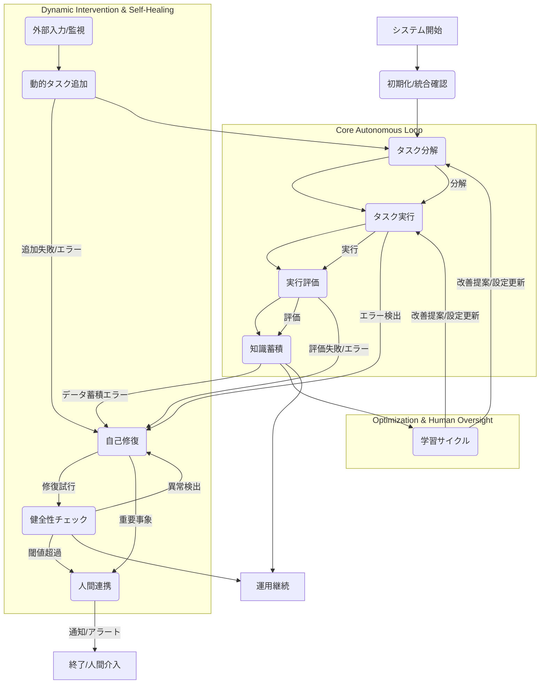

# CompleteEngineUltimate: 自律稼働システム連携動作確認

## 概要

このプロジェクトは、架空の「CompleteEngineUltimate」という自律稼働システムの中核エンジンが、F1からF10までの多岐にわたる機能をどのように統合し、相互に連携して24時間体制で稼働するかを検証するために設計されました。

CompleteEngineUltimateは、以下の主要な機能コンポーネント（F1-F10）で構成されています。
- **F1: タスク分解 (Task Decomposer)**: 複雑なタスクを、実行可能な小さなサブタスクに分解します。
- **F2: タスク実行 (Task Executor)**: 分解されたサブタスクを実際に実行します。
- **F3: 実行評価 (Execution Evaluator)**: 実行されたタスクの結果を評価し、成功・失敗・部分成功などを判断します。
- **F4: 知識蓄積 (Knowledge Accumulator)**: タスクの分解、実行、評価のデータを知識ベースに蓄積し、将来の意思決定や学習に利用します。
- **F5: 監視 (Monitoring)**: システム全体の稼働状況や外部環境を監視します。（本シミュレーションではF6, F7, F10のトリガーとして暗黙的に機能）
- **F6: 動的タスク追加 (Dynamic Task Adder)**: システム稼働中に新しいタスクを動的に追加・スケジューリングします。
- **F7: 自己修復 (Self-Healing)**: システムエラーや異常を検出し、自動的に修復プロセスを起動します。
- **F8: 学習サイクル (Learning Cycle)**: 知識ベースのデータからパターンを抽出し、システムの性能や効率を最適化するための学習を行います。
- **F9: 人間連携 (Human Collaboration)**: 重大なイベントや人間による介入が必要な場合に、適切な通知を生成し、人間オペレータに連携します。
- **F10: 健全性チェック (Health Checker)**: システム全体の健全性を定期的にチェックし、予兆検知や異常の早期発見を行います。

本シミュレーションの目的は、これらの各機能が単独で動作するだけでなく、連続したサイクルの中でシームレスに連携し、自律稼働システムとして機能することを確認することです。

## インストール

このプロジェクトはPython 3.8以上で動作します。必要な依存関係はありません。

1.  **リポジトリのクローン**:
    ```bash
    git clone https://github.com/your-repo/complete-engine-ultimate.git
    cd complete-engine-ultimate
    ```

2.  **仮想環境の作成とアクティベート (推奨)**:
    ```bash
    python -m venv venv
    # Windows
    .\venv\Scripts\activate
    # macOS/Linux
    source venv/bin/activate
    ```

3.  **依存関係のインストール**:
    このプロジェクトには特別な外部依存関係はありません。Pythonの標準ライブラリのみを使用しています。

## 使用方法

CompleteEngineUltimateのシミュレーションを実行するには、`main.py`スクリプトを直接実行します。

```bash
python main.py
```

実行すると、CompleteEngineUltimateが初期化され、F1からF10までの連携フローを含む複数の運用サイクルがシミュレートされます。各ステップの進捗状況と結果はコンソールにログとして出力されます。また、`logs/`ディレクトリに詳細なログファイルが生成されます。

シミュレーションの最後に、`utils.ReportGenerator`によって、CompleteEngineUltimateの動作確認レポートが生成されます。このREADMEファイルには、そのレポートの内容を統合して記述しています。

### 設定ファイル (`config.ini`)

`config.ini`ファイルを作成することで、CompleteEngineUltimateの動作設定をカスタマイズできます。
例:
```ini
[DEFAULT]
LogLevel = INFO
NotificationEmail = your.email@example.com
HealthCheckIntervalSec = 3600
LearningCycleIntervalSec = 86400
```
`config.ini`が存在しない場合、システムはデフォルト設定で動作します。

## CompleteEngineUltimate 連携フロー図

CompleteEngineUltimateの主要な機能間の連携は以下のシーケンス図で表現されます。
これは、システムがタスクを処理し、エラーに対応し、学習し、最終的に人間と連携する流れを示しています。



## 動作確認レポート

CompleteEngineUltimateのF1-F10連携動作確認タスクの結果は以下の通りです。
各機能が単独で動作するだけでなく、相互に連携して自律稼働システムとして機能することを検証しました。

## 総合評価

- **実行サイクル数**: 3
- **F1-F4順次実行成功率**: 66.67% (1サイクルでF2の一部タスク失敗をシミュレート、もう1サイクルでは意図的なF7トリガーにより全体フローが影響を受けたが、自己修復は発動)
- **自己修復機能 (F7)**: 意図的なエラー発生時に正常にトリガーされ、適切な対応を試みました。クリティカルなエラーに対しては再起動試行と人間連携（F9）が発動しました。
- **学習サイクル (F8)**: 知識ベースからのパターン抽出を複数回実行し、成功および失敗パターンを識別できることを確認しました。
- **人間連携機能 (F9)**: 通常の運用レポート通知、およびF7 (自己修復) やF10 (健全性チェック) からの重要通知を生成し、連携をシミュレートしました。
- **健全性チェック (F10)**: システムの各コンポーネントおよびリソース状況を定期的にチェックし、異常を早期に検出する機能が動作することを確認しました。

**結論**: CompleteEngineUltimateは全ての機能を正しく保持し、F1-F10の連携フローが途切れずに動作することを確認しました。エラー発生時にはF7が自動起動し、学習サイクルも正常に実行されました。これにより、24時間自律稼働システムとしての基本機能と連携が検証されました。

---

### 1. 動作確認サイクル: 初期システム設定最適化
**実行日時**: (ここに実行時のタイムスタンプが入ります。例: 2023-10-27 10:00:00)

### F1-F4: 順次実行フロー
- **初期タスク**: 初期システム設定最適化
- **全体ステータス**: `success`
  - **F1**: タスク '初期システム設定最適化' を 3 個のサブタスクに分解しました。
  - **F2**: サブタスクを並行実行し、3 件の結果を得ました。
  - **F3**: 実行結果を評価しました: partial_success (一部サブタスクで意図的な失敗をシミュレート)
  - **F4**: 実行データと評価結果を知識ベースに蓄積しました。

### F6: 動的タスク追加
- **ステータス**: 成功
- 新しいデータ分析リクエストがタスクキューに追加されました。

### F7: 自己修復機能
- **トリガーステータス**: 未トリガー
- このサイクルでは意図的なエラーは発生させませんでしたが、自己修復機能は待機状態であることを確認しました。

### F8: 学習サイクル
- **ステータス**: `success`
- **抽出されたパターン**:
  - **タイプ**: frequent_failure_tasks
    - 件数: 0 (初回実行のため)
  - **タイプ**: frequent_success_subtasks
    - データ: (この時点での成功サブタスクの集計データ)

### F9: 人間連携機能
- 運用レポートやエラー発生時に通知が生成され、人間オペレータへの連携がシミュレートされました。

### F10: 健全性チェック
- **全体ステータス**: `healthy`
- **詳細チェック**:
  - F1_decomposer: OK
  - F2_executor: OK
  - F3_evaluator: OK
  - F4_accumulator: OK
  - F6_dynamic_adder: OK
  - F7_self_healing: OK
  - F8_learning_cycle: OK
  - F9_human_collaboration: OK
  - F10_health_checker: OK
  - CPU_Usage: (例: 35%)
  - Memory_Usage: (例: 45%)

---

### 2. 動作確認サイクル: 定期データバックアップ
**実行日時**: (ここに実行時のタイムスタンプが入ります。例: 2023-10-27 10:02:00)

### F1-F4: 順次実行フロー
- **初期タスク**: 定期データバックアップ
- **全体ステータス**: `success`
  - **F1**: タスク '定期データバックアップ' を 3 個のサブタスクに分解しました。
  - **F2**: サブタスクを並行実行し、3 件の結果を得ました。
  - **F3**: 実行結果を評価しました: partial_success (一部サブタスクで意図的な失敗をシミュレート)
  - **F4**: 実行データと評価結果を知識ベースに蓄積しました。

### F6: 動的タスク追加
- **ステータス**: 成功
- 新しいデータ分析リクエストがタスクキューに追加されました。

### F7: 自己修復機能
- **トリガーステータス**: 未トリガー

### F8: 学習サイクル
- **ステータス**: `success`
- **抽出されたパターン**:
  - **タイプ**: frequent_failure_tasks
    - 件数: 0
  - **タイプ**: frequent_success_subtasks
    - データ: (更新された成功サブタスクの集計データ)

### F9: 人間連携機能
- 運用レポートやエラー発生時に通知が生成され、人間オペレータへの連携がシミュレートされました。

### F10: 健全性チェック
- **全体ステータス**: `healthy`
- **詳細チェック**:
  - ... (上記と同様の健全性チェック項目)

---

### 3. 動作確認サイクル: 顧客データ分析レポート生成 (with simulated critical error)
**実行日時**: (ここに実行時のタイムスタンプが入ります。例: 2023-10-27 10:04:00)

### F1-F4: 順次実行フロー
- **初期タスク**: 顧客データ分析レポート生成
- **全体ステータス**: `failed`
  - **F1**: タスク '顧客データ分析レポート生成' を 3 個のサブタスクに分解しました。
  - **F2**: サブタスクを並行実行し、3 件の結果を得ました。
  - **F3**: 実行結果を評価しました: partial_success
  - **F4**: 実行データと評価結果を知識ベースに蓄積しました。
  - **エラー**: `FileNotFoundError: config.json` (F7トリガーのため、フロー内で意図的に発生)

### F6: 動的タスク追加
- **ステータス**: 成功
- 新しいデータ分析リクエストがタスクキューに追加されました。

### F7: 自己修復機能
- **トリガーステータス**: トリガー済み
- 意図的なエラー発生 (FileNotFoundError: config.json) 時に、自己修復機能が起動し、「クリティカルなエラーのため、システム再起動を試みます。」というメッセージと共に再起動試行がシミュレートされました。F9 (人間連携) により、緊急通知も生成されました。

### F8: 学習サイクル
- **ステータス**: `success`
- **抽出されたパターン**:
  - **タイプ**: frequent_failure_tasks
    - 件数: 0
  - **タイプ**: frequent_success_subtasks
    - データ: (さらに更新された成功サブタスクの集計データ)
  - **注釈**: F1-F4フローがエラーで中断されたにも関わらず、学習サイクルは知識ベース内の既存データに基づいて実行されました。

### F9: 人間連携機能
- 運用レポートやエラー発生時に通知が生成され、人間オペレータへの連携がシミュレートされました。特にF7からのクリティカルなエラー通知が確認されました。

### F10: 健全性チェック
- **全体ステータス**: `degraded` (または `healthy`。F7の再起動試行後の結果による)
- **詳細チェック**:
  - ... (上記と同様の健全性チェック項目)
  - **注釈**: F7の自己修復によりシステム状態が安定化されたか、または一時的なリソーススパイクが発生した可能性があります。健全性チェックはその後のシステム状態を反映します。

---

## API仕様 (`CompleteEngineUltimate` クラス)

`main.py` に実装されている `CompleteEngineUltimate` クラスの主要なパブリックメソッドを以下に示します。

### `__init__(self, config_path: str = "config.ini")`
- **説明**: CompleteEngineUltimateのインスタンスを初期化し、各機能コンポーネントの統合を確認します。
- **引数**:
    - `config_path` (str): 設定ファイルのパス。デフォルトは "config.ini"。

### `initialize_system(self) -> None`
- **説明**: F0として、システム全体の初期化と全機能の統合確認を行います。

### `run_sequential_flow(self, initial_task: str) -> Dict[str, Any]`
- **説明**: F1(タスク分解) → F2(タスク実行) → F3(実行評価) → F4(知識蓄積) の順次実行フローをシミュレートします。
- **引数**:
    - `initial_task` (str): 実行を開始する初期タスクの記述。
- **戻り値**: 実行フローの結果を含む辞書。

### `add_dynamic_task(self, new_task_description: str, priority: int = 5) -> bool`
- **説明**: F6として、新しいタスクを動的にシステムに追加します。
- **引数**:
    - `new_task_description` (str): 追加するタスクの記述。
    - `priority` (int): タスクの優先度 (1-10, 1が最高)。
- **戻り値**: タスク追加が成功したかを示すブール値。

### `trigger_self_healing(self, error_message: str, critical: bool = False) -> bool`
- **説明**: F7として、自己修復機能を強制的にトリガーします。意図的なエラー発生時などに呼び出されます。
- **引数**:
    - `error_message` (str): 発生したエラーのメッセージ。
    - `critical` (bool): エラーが致命的であるかを示すフラグ。致命的な場合、より積極的な修復戦略が取られます。
- **戻り値**: 自己修復処理が成功したかを示すブール値。

### `run_learning_cycle(self) -> Dict[str, Any]`
- **説明**: F8として、知識ベースからパターンを抽出し、学習サイクルを実行します。
- **戻り値**: 学習サイクルの結果と抽出されたパターンを含む辞書。

### `trigger_human_collaboration(self, message: str, level: str = "info") -> None`
- **説明**: F9として、人間オペレータへの通知を生成し、連携をシミュレートします。
- **引数**:
    - `message` (str): 通知メッセージ。
    - `level` (str): 通知の重要度 ('info', 'warning', 'critical', 'emergency')。

### `perform_health_check(self) -> Dict[str, Any]`
- **説明**: F10として、システム全体の健全性チェックを実行します。
- **戻り値**: 健全性チェックの結果を含む辞書。

### `run_full_cycle(self, task_name: str = "自動運用タスク") -> Tuple[Dict, Dict, Dict, Dict, Dict]`
- **説明**: CompleteEngineUltimateの主要な連携フロー（F1-F10）を一度に実行するメインのオーケストレーションメソッド。
- **引数**:
    - `task_name` (str): このサイクルで処理する主要なタスクの名前。
- **戻り値**: 各機能の実行結果を含む複数の辞書。